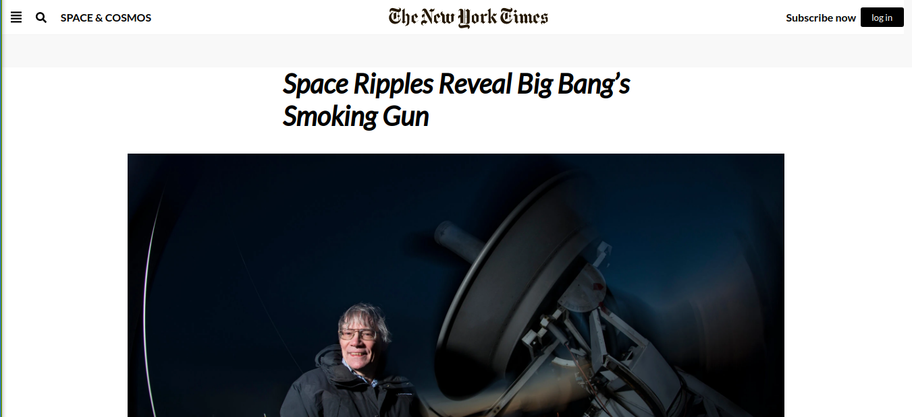

## Positioning and Floating Elements

This project was created to strengthen knowledge of Positioning and Floating Elements into a website using the The New York Times page as a guide.

## Built With

- HTML
- CSS

## Live Demo

[Live Demo Link]( https://serene-hopper-cb63b8.netlify.app/#)

## Getting Started

**To view this project, download the contents of the repository to your computer or clone the repository and open the index.html file using your preferred browser.**

## Authors

¤ **MUGIRASE Emmanuel**

- Github: [@descholar-ceo](https://github.com/descholar-ceo)
- Linkedin : [@MUGIRASE Emmanuel](https://www.linkedin.com/in/mugirase-emmanuel-a90b49143/)
- Twitter: [@descholar](https://twitter.com/@descholar3)

¤ **Razika**

- Github: [@rahalrazika](https://github.com/rahalrazika)
- Linkedin : [@razika rahal](https://www.linkedin.com/in/razika-rahal-85539bbb/)
- Twitter: [@RereRere055](https://twitter.com/RereRere055)

##  Contributing

Contributions, issues and feature requests are welcome!

## Show your support

Give a  if you like this project

## Acknowledgments

- The New York Times 
